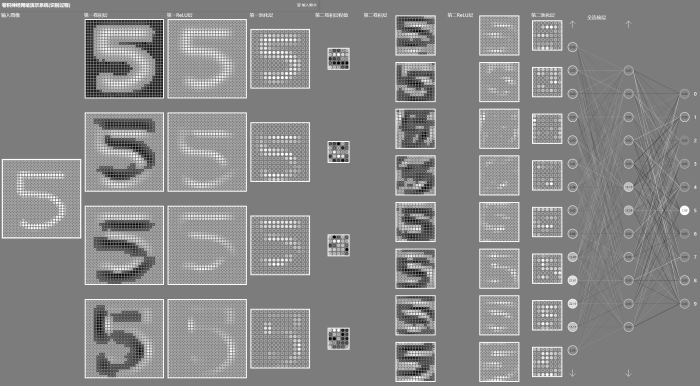
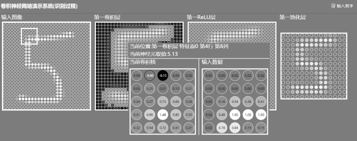

卷积神经网络演示系统
=======================

这是一个关于卷积神经网络的演示系统. 本系统使用Python的TensorFlow构建了一个识别手写数字的卷积神经网络, 并且通过HTML5技术在网页上展示此卷积神经网络识别手写数字的计算过程.

计算过程的全局页面如下所示, 下图进行了缩放, 实际使用时屏幕只能展示下图大约四分之一的面积.



针对上图的每一个节点, 鼠标指向时会展示其中的计算细节,具体如下所示



上图展示了卷积过程的局部细节

.jpg)

上图展示了全连接层的计算细节

项目依赖
---------------
本项目使用Python3.6作为解释器， 依赖flask、Pillow、numpy和TensorFlow。由于Tensorflow版本问题， 本项目只能使用Python 3.6 + Tensorflow 1.12.0， 其余版本没有经过测试，不能保证可以正常运行。建议使用Conda管理Python环境。

```bash
$ pip install flask Pillow numpy tensorflow==1.12.0
```

如果有可用的GPU，可以安装GPU版本的TensorFlow

```bash
$ pip install  tensorflow-gpu==1.12.0
```

GPU版本需要进行配置才能使用, 配置过程可以参考TensorFlow官网指南


运行项目
----------

### 项目初始化

初始化阶段生成配置文件并且使用模型产生训练动画的数据

```bash
$ ./initialize.py
$ ./newModel.py --Train
```

各个脚本的详细配置参数可以使用`-h`参数查看

### 启动项目

```bash
$ ./app.py
```
